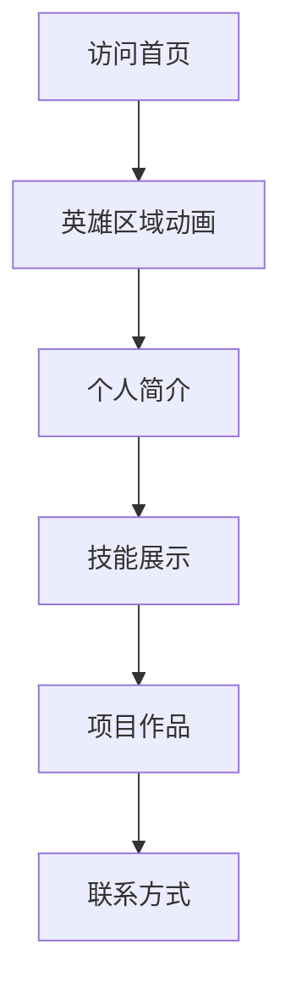

## 1. 产品概述
一个炫酷的暗黑风格个人博客展示页面，用于自我介绍和个人品牌展示。访客可以通过这个页面快速了解博主的个人信息、技能特长、项目经历等内容。

目标用户为希望建立个人品牌、展示专业能力的个人用户，通过视觉冲击力强的设计给访客留下深刻印象。

## 2. 核心功能

### 2.1 用户角色
本页面为纯展示型页面，无需用户注册登录功能。

### 2.2 功能模块
个人博客展示页面包含以下核心模块：
1. **首页展示**：个人简介、技能展示、项目作品、联系方式

### 2.3 页面详情
| 页面名称 | 模块名称 | 功能描述 |
|---------|---------|----------|
| 首页展示 | 英雄区域 | 展示个人头像、姓名、职位标语，包含粒子动画背景效果 |
| 首页展示 | 个人简介 | 展示个人基本信息、职业经历、教育背景 |
| 首页展示 | 技能展示 | 以进度条或图标形式展示技术技能，支持悬停动画 |
| 首页展示 | 项目作品 | 展示个人项目卡片，包含项目图片、标题、描述、技术栈 |
| 首页展示 | 联系方式 | 展示社交媒体链接、邮箱等联系方式，支持点击跳转 |
| 首页展示 | 页面导航 | 平滑滚动到对应区域，高亮当前所在区域 |

## 3. 核心流程
访客访问页面 -> 浏览英雄区域动画 -> 滚动查看个人简介 -> 查看技能展示 -> 浏览项目作品 -> 查看联系方式

## 4. 用户界面设计

### 4.1 设计风格
- **主色调**: 深灰色 (#1a1a1a) 作为背景，紫色 (#8b5cf6) 作为强调色
- **辅助色**: 亮紫色 (#a855f7)、深蓝色 (#3b82f6)
- **按钮样式**: 渐变背景、圆角设计、悬停发光效果
- **字体**: 英文使用 Inter，中文使用思源黑体，标题 32-48px，正文 16-18px
- **布局风格**: 单页滚动设计，卡片式内容展示
- **图标风格**: 使用线性图标，支持悬停变色动画

### 4.2 页面设计概览
| 页面名称 | 模块名称 | UI元素 |
|---------|---------|---------|
| 首页展示 | 英雄区域 | 全屏深色背景，粒子动画效果，中央圆形头像，发光边框，渐变文字标题 |
| 首页展示 | 个人简介 | 两栏布局，左侧头像右侧文字，卡片式背景，悬停上浮动画 |
| 首页展示 | 技能展示 | 网格布局技能卡片，圆形进度条，悬停放大效果，技能名称发光文字 |
| 首页展示 | 项目作品 | 瀑布流布局项目卡片，图片悬停放大，技术标签悬停高亮 |
| 首页展示 | 联系方式 | 底部通栏设计，社交媒体图标横向排列，点击波纹效果 |
| 首页展示 | 页面导航 | 顶部固定导航栏，滚动时背景模糊，当前区域高亮显示 |

### 4.3 响应式设计
- 桌面端优先设计，支持1920px及以上分辨率
- 平板端适配768px-1024px，调整网格布局为2列
- 移动端适配375px-767px，改为单列布局，导航菜单折叠
- 支持触摸滑动操作，动画效果在移动端适当简化

### 4.4 动画效果指导
- **页面加载动画**: 渐显效果，元素依次出现
- **滚动触发动画**: 元素进入视口时触发淡入和上移动画
- **悬停动画**: 按钮发光、卡片上浮、图片放大
- **背景动画**: 粒子系统缓慢移动，营造科技感
- **文字动画**: 打字机效果展示标题，渐变色彩变化