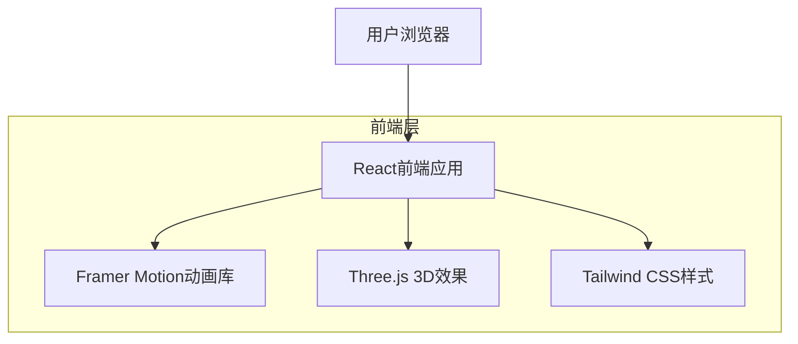

## 1. 架构设计



## 2. 技术描述

- **前端**: React@18 + TypeScript + Vite
- **初始化工具**: vite-init
- **样式框架**: Tailwind CSS@3 + 自定义暗黑主题
- **动画库**: Framer Motion@10
- **3D效果**: Three.js@0.158 + @react-three/fiber@8
- **图标**: Lucide React@0.294
- **后端**: 无（纯静态展示页面）

## 3. 路由定义

| 路由 | 用途 |
|------|------|
| / | 首页，包含所有展示内容的单页应用 |

## 4. 核心组件结构

### 4.1 主要组件
```typescript
// 页面主组件
interface HomePageProps {
  className?: string;
}

// 英雄区域组件
interface HeroSectionProps {
  name: string;
  title: string;
  subtitle: string;
  avatarUrl: string;
}

// 技能展示组件
interface SkillCardProps {
  skillName: string;
  level: number; // 0-100
  icon: React.ReactNode;
  color: string;
}

// 项目卡片组件
interface ProjectCardProps {
  title: string;
  description: string;
  imageUrl: string;
  techStack: string[];
  projectUrl?: string;
}

// 联系方式组件
interface ContactItemProps {
  platform: string;
  username: string;
  url: string;
  icon: React.ReactNode;
}
```

### 4.2 动画配置
```typescript
// 滚动触发动画配置
const fadeInUp = {
  initial: { opacity: 0, y: 60 },
  animate: { opacity: 1, y: 0 },
  transition: { duration: 0.6, ease: "easeOut" }
};

// 悬停动画配置
const hoverScale = {
  whileHover: { scale: 1.05 },
  whileTap: { scale: 0.95 }
};

// 粒子系统配置
interface ParticleConfig {
  count: number;
  size: number;
  speed: number;
  color: string;
  opacity: number;
}
```

## 5. 性能优化

### 5.1 图片优化
- 使用 WebP 格式图片，提供 JPEG  fallback
- 实施懒加载，优先加载视口内图片
- 使用 CDN 加速图片加载

### 5.2 动画优化
- 使用 CSS transform 和 opacity 属性实现动画
- 启用 GPU 硬件加速
- 在移动端降低动画复杂度

### 5.3 代码分割
- 按组件进行代码分割
- 延迟加载非关键组件
- 预加载关键资源

## 6. 暗黑主题配置

```typescript
// Tailwind 暗黑主题配置
const darkTheme = {
  colors: {
    background: '#1a1a1a',
    surface: '#2d2d2d',
    primary: '#8b5cf6',
    secondary: '#a855f7',
    accent: '#3b82f6',
    text: {
      primary: '#ffffff',
      secondary: '#b3b3b3',
      muted: '#808080'
    }
  },
  animation: {
    'fade-in': 'fadeIn 0.6s ease-in-out',
    'slide-up': 'slideUp 0.8s ease-out',
    'glow': 'glow 2s ease-in-out infinite alternate'
  }
};
```

## 7. 浏览器兼容性

- **支持浏览器**: Chrome 90+, Firefox 88+, Safari 14+, Edge 90+
- **polyfill**: 自动添加必要的 polyfill
- **降级处理**: 不支持动画的浏览器提供静态展示
- **移动端**: iOS Safari 12+, Chrome Android 90+

## 8. 部署配置

### 8.1 构建配置
```javascript
// vite.config.ts
export default {
  build: {
    target: 'es2015',
    minify: 'terser',
    cssCodeSplit: true,
    rollupOptions: {
      output: {
        manualChunks: {
          vendor: ['react', 'react-dom'],
          animation: ['framer-motion'],
          three: ['three', '@react-three/fiber']
        }
      }
    }
  }
};
```

### 8.2 静态资源优化
- 启用 Gzip 压缩
- 设置合理的缓存策略
- 使用 Service Worker 进行资源缓存